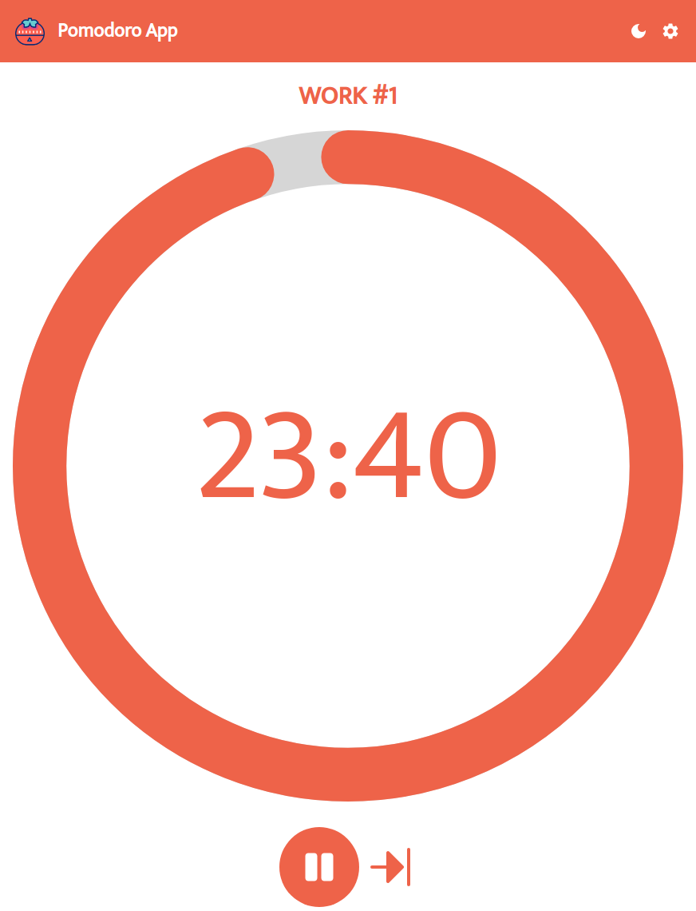

# React Project: Pomodoro App

The goal of this project was to create a timer app that counts down using the pomodoro technique. It alternates work sessions with breaks. There's a long break every 4 pomodoros.

I used this https://github.com/kevinsqi/react-circular-progressbar to add the progress bar functionality and this https://github.com/joshwcomeau/use-sound to play the alarm sound after the timer reaches 0. 

I started and finished this project in July 2024.

## Technology

- React
- JavaScript
- CSS
- Vite

## Key Concepts

- State: useState, changing/updating state
- useEffect: side effects, syntax, dependencies array, cleanup when the component unmounts
- Inputs in React
- Conditional rendering
- setInterval

## Features

- Light & dark mode.
- Time settings can be customized by the user. Settings can be restored to default values.
- Timer can be stopped/resumed at any moment.
- Work session/break can be skipped.
- Alarm sound is played after the timer reaches 0 or the user skips a work session/break.

## Links

[Live Demo](https://bn7631-pomodoro-app.pages.dev/)

## Screenshots

### Desktop




### Mobile


## Sources

- <a href="https://www.flaticon.com/free-icons/timer" title="timer icons">Timer icons created by Freepik - Flaticon</a>
- Sound Effect by <a href="https://pixabay.com/users/microsammy-22905943/?utm_source=link-attribution&utm_medium=referral&utm_campaign=music&utm_content=8761">Microsammy</a> from <a href="https://pixabay.com//?utm_source=link-attribution&utm_medium=referral&utm_campaign=music&utm_content=8761">Pixabay</a>
- https://fonts.google.com/specimen/Mukta

## Deployment

```bash
# clone repo
git clone https://github.com/BrightNeon7631/pomodoro.git

# install project dependencies
npm install

# run vite dev server
npm run dev

# create a production build
npm run build
```